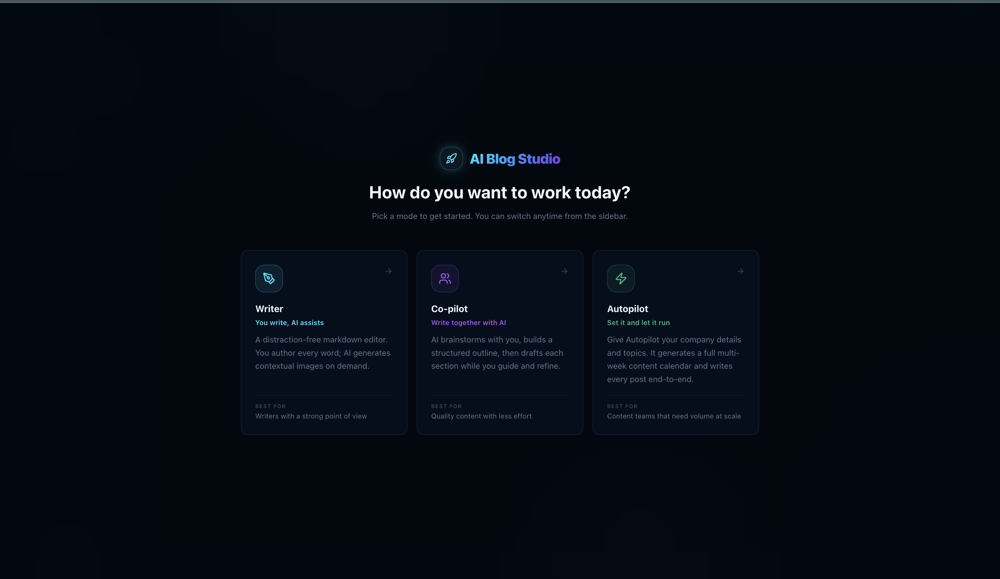

# AI BlogStudio

An AI-powered blog authoring workspace. Plan a content calendar, draft posts section-by-section with an LLM co-pilot, generate matching images, and export the result to Markdown or HTML.

## Features

- Three writing modes: **Writer**, **Copilot**, and **Autopilot** — pick how much of the work you want the AI to do.
- Conversational outliner — answer a short questionnaire and get a structured outline you can refine.
- Section-by-section drafting with inline suggestions and follow-up chips.
- Image generation via OpenAI or Google Gemini, embedded directly into post sections.
- Persistent blog projects saved to disk; static asset hosting for generated images.
- One-click export to Markdown or HTML.

## The three modes

Blog Studio is built around a spectrum of authorial control. When you launch the app you're greeted by the mode picker — choose how hands-on you want to be, and switch anytime from the sidebar.



---

### Writer — you drive

A clean, distraction-free markdown editor for writers who want to put words on the page themselves. The AI stays out of the way; you write headings, sections, and prose, using the toolbar to apply formatting (H1/H2, bold, italic, lists) or insert an AI-generated image anywhere in the post. Toggle **Preview** at any time to see a rendered version of your markdown. Best when you have a strong point of view and want the tool to be a quiet workspace rather than a co-author.


---

### Copilot — write together

A conversational partner sits alongside the editor. Answer a short kickoff questionnaire to define audience, tone, and goals, and Co-pilot proposes a structured outline — one card per section — that you can reorder and edit. From there, draft section-by-section: generate copy for any card, request alternatives, refine with follow-up suggestion chips, or generate a matching image inline. You stay in control of what makes it into the post; the AI just speeds up the thinking and typing. Best for most blog work where you want quality output without ceding the editorial voice.


---

### Autopilot — set it and let it run

Give Autopilot a company name, target audience, description, topic list, and a posts-per-week cadence, and it produces a full multi-week content calendar — then generates each post end-to-end: outline, section copy, and interleaved AI images. Each entry tracks a status (`planned` → `generating` → `done`) so you can watch the batch progress in real time. Finished posts land in your project list ready to review, edit, and export. Best for content marketing batches, campaign launches, or seeding a new blog quickly.


---

## Coming soon — AI BlogStudio Pro

A dedicated hosted platform is in development. The open-source version you're running today will remain free; the features below will be available to paid members on the website.

### Pillar 1 — Company Knowledge Base *(The PageIndex Engine)*

Replace generic AI output with reasoning-based retrieval grounded in your own source material. Built on [VectifyAI/PageIndex](https://github.com/VectifyAI/PageIndex) instead of flat vector stores.

- **Hierarchical indexing:** Every uploaded document (PDF, DOCX, Notion page, Google Drive file) is parsed into a Tree Index — Chapters → Sections → Paragraphs — so the retrieval system understands structure, not just similarity scores.
- **Two-stage reasoning retrieval:** Stage 1 — the LLM scans the Tree Index to identify relevant branches for the current blog topic. Stage 2 — it drills into those specific nodes to extract precise, authoritative data. No flat embedding lookup; no hallucinated citations.
- **Source provenance:** Every generated section carries a full citation path (e.g., `Google Drive › 2026_Tariff_Spec.pdf › Section 3.2`) so editors can verify technical accuracy against the original document.
- **Freshness scoring:** Nodes from documents with a `last_modified` date older than 18 months are automatically down-ranked so stale content doesn't crowd out recent product updates.

### Pillar 2 — GitHub → Blog Pipeline *(The Narrative Diff Engine)*

Engineering teams produce enormous documentation value in PRs and release notes that never reaches the blog. This event-driven pipeline closes that gap automatically.

- **GitHub App integration:** Webhook listeners for `PR_MERGED` (filtered to the `blog-worthy` label) and `RELEASE_PUBLISHED` trigger automatic draft creation — no manual hand-off required.
- **Functional narrative extraction:** An LLM "Narrator" receives the PR description, commit history, and code delta and extracts the *Why* and *Impact* of the change — ignoring boilerplate and focusing on what actually matters to a technical reader.
- **Security sandbox:** Every diff is scanned by TruffleHog or Gitleaks before it touches the LLM. If a secret (API key, credential, token) is detected, generation fails instantly and the event is flagged for review.
- **Draft review inbox:** Generated posts land in a *Pending* state with the original GitHub PR linked side-by-side — editors approve, edit, or discard before anything is published.

### Pillar 3 — Prompt Templates & Brand Config *(The Governance Layer)*

Define your company's writing rules once. Every generation call inherits them automatically, with role-based controls over who can override what.

- **Variable registry:** A CRUD interface lets admins define org-level variables — `{{brand_voice}}`, `{{target_audience}}`, `{{forbidden_claims}}`, `{{cta_template}}` — injected into every prompt automatically.
- **Highest-specificity inheritance:** Post-level overrides beat topic-level templates, which beat org defaults. Writers always work within the guardrails their team has set, never around them.
- **Proprietary context blocks:** Admins store multi-paragraph blocks — legal disclaimers, mission statements, pricing language — that are injected *verbatim* into the prompt, bypassing the LLM's tendency to paraphrase sensitive copy.
- **Role-based access (RBAC):** Org Admins can lock specific variables so Content Managers and Writers cannot modify them during drafting. Every draft records which variable snapshot was active at generation time for full auditability.

### Pillar 4 — Automatic SEO & Internal Linking *(The Firecrawl Architect)*

Use real-time web crawling to map your live blog and automate site architecture and search optimization — no manual tagging or spreadsheet maintenance.

- **Live site discovery:** The [Firecrawl](https://www.firecrawl.dev/) `/crawl` endpoint indexes every published URL on your domain, extracting titles, keywords, and clean Markdown content into a live site graph.
- **Semantic link injection:** When a new post is generated, its content is compared against the Firecrawl index. The system identifies natural anchor points in the prose and injects internal links to the most semantically relevant existing posts — with descriptive anchor text derived from the target post's H1, never generic "click here" text.
- **Competitive gap analysis:** Firecrawl scrapes the top 3 ranking competitor pages for your target topic. Their heading structures are analyzed and any sub-topics they cover that your draft is missing are surfaced as *Keyword Gaps* and passed back to the outline generator before drafting begins.
- **Schema & metadata generation:** Every export automatically includes JSON-LD structured data (`Article`, `BreadcrumbList`, `FAQ` where applicable) and optimized meta tags (title ≤60 chars, description ≤155 chars) built from the live site's existing structure.

---

## Tech stack

- **Frontend:** React 19, TypeScript, Vite, Tailwind CSS 4, axios, lucide-react.
- **Backend:** FastAPI (Python), Uvicorn, Pydantic v2.
- **AI providers:** OpenAI, Anthropic, Google GenAI (Gemini).

## Project structure

```
blog-studio/
├── src/                    # React frontend
│   ├── components/blog/    # Blog editor, chat, plan, image UI
│   ├── App.tsx
│   ├── main.tsx
│   └── types.ts            # Shared TS types (BlogProject, ContentPlan, ...)
├── backend/                # FastAPI service
│   ├── main.py             # App entry, CORS, static mounts
│   ├── routers/blog.py     # /api/blog/* endpoints
│   ├── services/           # LLM + image-gen logic
│   ├── blog_projects/      # Persisted project JSON (gitignored)
│   └── blog_assets/        # Generated images served at /blog-assets
├── package.json
├── vite.config.ts
└── .env.example
```

## Prerequisites

- Node.js 20+
- Python 3.10+
- An OpenAI API key (required); Gemini key optional for Gemini image generation.

## Setup

### 1. Clone and install frontend dependencies

```bash
git clone <your-repo-url> blog-studio
cd blog-studio
npm install
```

### 2. Configure environment variables

Copy `.env.example` to `.env` and fill in your keys:

```bash
cp .env.example .env
```

```
OPENAI_API_KEY=sk-...
# GEMINI_API_KEY=...   # optional
# ANTHROPIC_API_KEY=... # optional, used by Claude services
```

### 3. Set up the backend

```bash
cd backend
python -m venv venv
source venv/bin/activate          # on Windows: venv\Scripts\activate
pip install -r requirements.txt
```

## Running locally

Run the backend and frontend in two terminals.

**Backend** (from `backend/`, with venv active):

```bash
python main.py
# serves http://localhost:8000
```

**Frontend** (from project root):

```bash
npm run dev
# serves http://localhost:5173
```

The frontend talks to the backend at `http://localhost:8000/api/blog/*` via axios.

## Available scripts

| Command | What it does |
| --- | --- |
| `npm run dev` | Start the Vite dev server with HMR. |
| `npm run build` | Type-check (`tsc -b`) and build the production bundle. |
| `npm run preview` | Preview the production build locally. |
| `npm run lint` | Run ESLint over the project. |

## API overview

All routes are prefixed with `/api/blog`.

| Method | Path | Purpose |
| --- | --- | --- |
| POST | `/chat` | Conversational drafting / Q&A. |
| POST | `/chat-initial-questions` | Generate the kickoff questionnaire. |
| POST | `/chat-suggestions` | Suggest follow-up chips. |
| POST | `/outline` | Produce a structured outline. |
| POST | `/refine-outline` | Edit an outline based on feedback. |
| POST | `/draft-section` | Draft a single section. |
| POST | `/generate-image` | Generate an image (OpenAI or Gemini). |
| POST | `/auto-plan` | Build a multi-week content plan. |
| POST | `/auto-generate` | Generate every post in a plan. |
| POST | `/export` | Export a project to Markdown or HTML. |
| GET | `/projects` | List saved projects. |
| GET | `/projects/{id}` | Fetch a project. |
| PUT | `/projects/{id}` | Update a project. |
| POST | `/projects` | Create a new project. |

Generated images are served as static files under `/blog-assets/...`.

## Notes

- Project state is persisted as JSON files under `backend/blog_projects/`. Delete a file to remove a project.
- Generated image binaries live under `backend/blog_assets/`. Both directories are created at startup if missing.
- CORS is open (`allow_origins=["*"]`) for local development — lock this down before deploying.

## License

Private / unlicensed. Add a license file if you intend to distribute.
