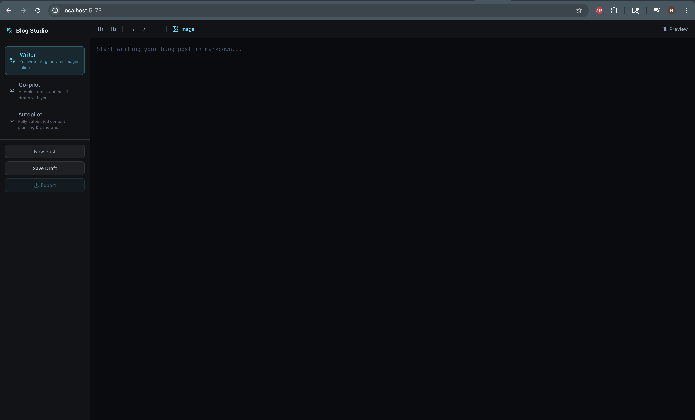
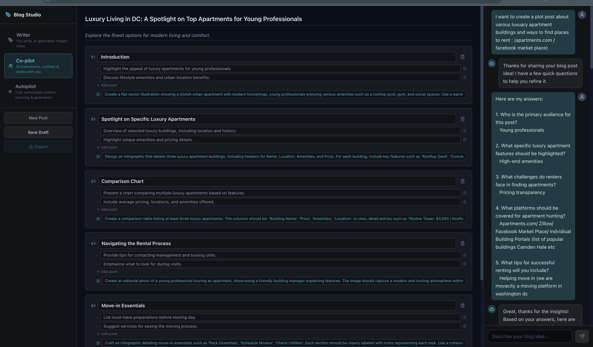
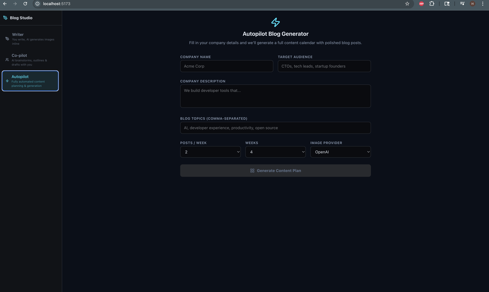

# AI BlogStudio

An AI-powered blog authoring workspace. Plan a content calendar, draft posts section-by-section with an LLM co-pilot, generate matching images, and export the result to Markdown or HTML.

## Features

- Three writing modes: **Writer**, **Copilot**, and **Autopilot** — pick how much of the work you want the AI to do.
- Conversational outliner — answer a short questionnaire and get a structured outline you can refine.
- Section-by-section drafting with inline suggestions and follow-up chips.
- Image generation via OpenAI or Google Gemini, embedded directly into post sections.
- Persistent blog projects saved to disk; static asset hosting for generated images.
- One-click export to Markdown or HTML.

## The three modes

Blog Studio is built around a spectrum of authorial control. You choose how hands-on you want to be on a per-project basis.

### Writer — you drive

A clean, distraction-free markdown editor for writers who want to put words on the page themselves. The AI stays out of the way; you write headings, sections, and prose, using the toolbar to apply formatting (H1/H2, bold, italic, lists) or insert an AI-generated image anywhere in the post. Toggle **Preview** at any time to see a rendered version of your markdown. Best when you have a strong point of view and want the tool to be a quiet workspace rather than a co-author.



---

### Copilot — write together

A conversational partner sits alongside the editor. Answer a short kickoff questionnaire to define audience, tone, and goals, and Co-pilot proposes a structured outline — one card per section — that you can reorder and edit. From there, draft section-by-section: generate copy for any card, request alternatives, refine with follow-up suggestion chips, or generate a matching image inline. You stay in control of what makes it into the post; the AI just speeds up the thinking and typing. Best for most blog work where you want quality output without ceding the editorial voice.



---

### Autopilot — set it and let it run

Give Autopilot a company name, target audience, description, topic list, and a posts-per-week cadence, and it produces a full multi-week content calendar — then generates each post end-to-end: outline, section copy, and interleaved AI images. Each entry tracks a status (`planned` → `generating` → `done`) so you can watch the batch progress in real time. Finished posts land in your project list ready to review, edit, and export. Best for content marketing batches, campaign launches, or seeding a new blog quickly.



---

## Coming soon — AIBlogStudio Pro

A dedicated hosted platform is in development. The open-source version you're running today will remain free; the features below will be available to paid members on the website.

### Pillar 1 — Company Knowledge Base

Upload your company's source material once and every post you generate will be grounded in it — no more generic AI output that could have been written by anyone.

- **Document ingestion:** Upload PDFs, DOCX files, CSVs, and data sheets. Connect Confluence, Notion, Google Drive, or OneDrive via OAuth.
- **RAG pipeline:** Uploaded content is chunked, embedded, and stored in a vector database (pgvector / Pinecone) isolated per organization.
- **Retrieval at generation time:** The most relevant passages from your knowledge base are retrieved and injected into every section draft as authoritative context — with source provenance so editors can verify citations.
- **Freshness scoring:** Documents older than 18 months are down-ranked so stale content doesn't crowd out recent product updates.

### Pillar 2 — GitHub → Blog Pipeline

Engineering teams produce enormous documentation value in READMEs, PR descriptions, and release notes that never reaches the company blog. This pipeline closes that gap automatically.

- **GitHub App integration:** Install on any org; opt specific repos in or out.
- **Trigger events:** Release tags, PR merges labeled `blog-worthy`, significant README changes, and a weekly commit digest all trigger automatic draft creation.
- **Diff summarizer:** Extracts the "what changed and why" narrative from git diffs before passing to the generation pipeline.
- **Draft review queue:** Auto-generated posts land in a *Pending Review* inbox — editors approve, edit, or discard before anything is published.
- **Security:** HMAC webhook validation, secrets scanning (trufflehog) before any diff reaches the LLM, and raw code is never stored.

### Pillar 3 — Prompt Templates & Brand Config

Define your company's writing rules once. Every generation call inherits them automatically, with role-based controls over who can change what.

- **Variable registry:** Admins configure org-level variables — `{{brand_voice}}`, `{{target_audience}}`, `{{forbidden_claims}}`, `{{product_names}}`, `{{cta_template}}` — that are injected into every prompt.
- **Template inheritance:** Post-level overrides → topic-level templates → org defaults → system defaults. Highest specificity wins.
- **Role-based access:** Org Admins lock sensitive variables (legal copy, pricing language); Content Managers own topic templates; Writers get per-post overrides on unlocked fields only.
- **Proprietary context blocks:** Multi-paragraph positioning statements, regulatory boilerplate, and internal glossaries injected verbatim for relevant post categories.
- **Auditability:** Every draft records which variable snapshot was active at generation time.

### CMS publishing & analytics *(roadmap)*

- One-click publish to WordPress, Webflow, and Ghost via their respective APIs.
- Brand voice lint pass after generation — automatic scan for forbidden claims and tone violations before a post reaches the editor.
- Usage dashboard: posts generated / approved / published per week, token spend, and image generation costs per project.

---

## Tech stack

- **Frontend:** React 19, TypeScript, Vite, Tailwind CSS 4, axios, lucide-react.
- **Backend:** FastAPI (Python), Uvicorn, Pydantic v2.
- **AI providers:** OpenAI, Anthropic, Google GenAI (Gemini).

## Project structure

```
blog-studio/
├── src/                    # React frontend
│   ├── components/blog/    # Blog editor, chat, plan, image UI
│   ├── App.tsx
│   ├── main.tsx
│   └── types.ts            # Shared TS types (BlogProject, ContentPlan, ...)
├── backend/                # FastAPI service
│   ├── main.py             # App entry, CORS, static mounts
│   ├── routers/blog.py     # /api/blog/* endpoints
│   ├── services/           # LLM + image-gen logic
│   ├── blog_projects/      # Persisted project JSON (gitignored)
│   └── blog_assets/        # Generated images served at /blog-assets
├── package.json
├── vite.config.ts
└── .env.example
```

## Prerequisites

- Node.js 20+
- Python 3.10+
- An OpenAI API key (required); Gemini key optional for Gemini image generation.

## Setup

### 1. Clone and install frontend dependencies

```bash
git clone <your-repo-url> blog-studio
cd blog-studio
npm install
```

### 2. Configure environment variables

Copy `.env.example` to `.env` and fill in your keys:

```bash
cp .env.example .env
```

```
OPENAI_API_KEY=sk-...
# GEMINI_API_KEY=...   # optional
# ANTHROPIC_API_KEY=... # optional, used by Claude services
```

### 3. Set up the backend

```bash
cd backend
python -m venv venv
source venv/bin/activate          # on Windows: venv\Scripts\activate
pip install -r requirements.txt
```

## Running locally

Run the backend and frontend in two terminals.

**Backend** (from `backend/`, with venv active):

```bash
python main.py
# serves http://localhost:8000
```

**Frontend** (from project root):

```bash
npm run dev
# serves http://localhost:5173
```

The frontend talks to the backend at `http://localhost:8000/api/blog/*` via axios.

## Available scripts

| Command | What it does |
| --- | --- |
| `npm run dev` | Start the Vite dev server with HMR. |
| `npm run build` | Type-check (`tsc -b`) and build the production bundle. |
| `npm run preview` | Preview the production build locally. |
| `npm run lint` | Run ESLint over the project. |

## API overview

All routes are prefixed with `/api/blog`.

| Method | Path | Purpose |
| --- | --- | --- |
| POST | `/chat` | Conversational drafting / Q&A. |
| POST | `/chat-initial-questions` | Generate the kickoff questionnaire. |
| POST | `/chat-suggestions` | Suggest follow-up chips. |
| POST | `/outline` | Produce a structured outline. |
| POST | `/refine-outline` | Edit an outline based on feedback. |
| POST | `/draft-section` | Draft a single section. |
| POST | `/generate-image` | Generate an image (OpenAI or Gemini). |
| POST | `/auto-plan` | Build a multi-week content plan. |
| POST | `/auto-generate` | Generate every post in a plan. |
| POST | `/export` | Export a project to Markdown or HTML. |
| GET | `/projects` | List saved projects. |
| GET | `/projects/{id}` | Fetch a project. |
| PUT | `/projects/{id}` | Update a project. |
| POST | `/projects` | Create a new project. |

Generated images are served as static files under `/blog-assets/...`.

## Notes

- Project state is persisted as JSON files under `backend/blog_projects/`. Delete a file to remove a project.
- Generated image binaries live under `backend/blog_assets/`. Both directories are created at startup if missing.
- CORS is open (`allow_origins=["*"]`) for local development — lock this down before deploying.

## License

Private / unlicensed. Add a license file if you intend to distribute.
